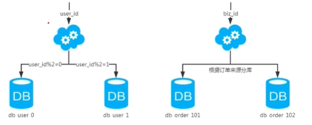
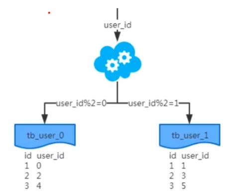
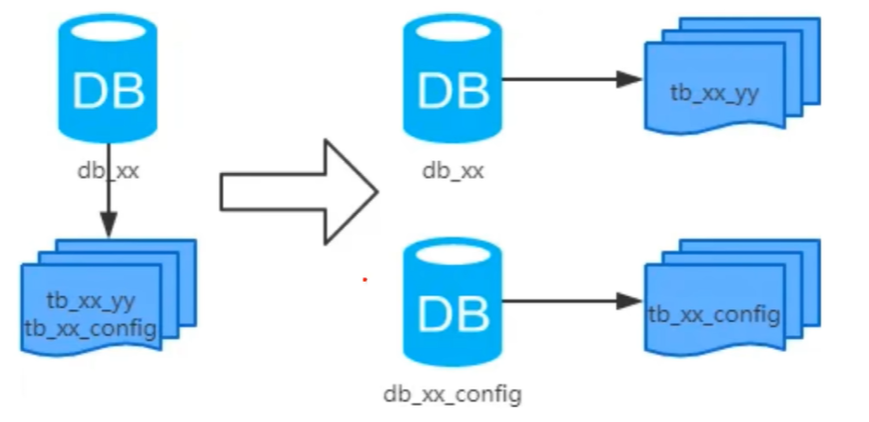
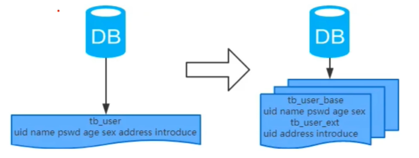
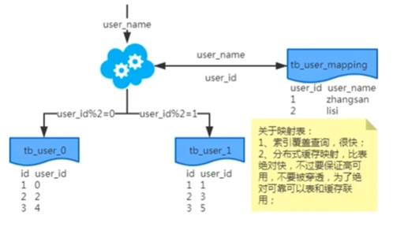
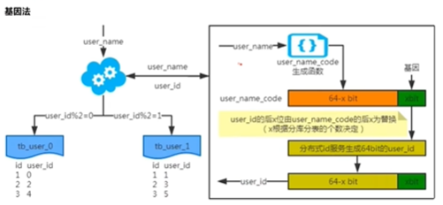
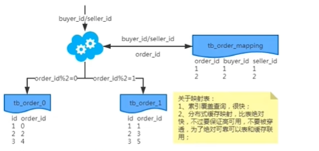
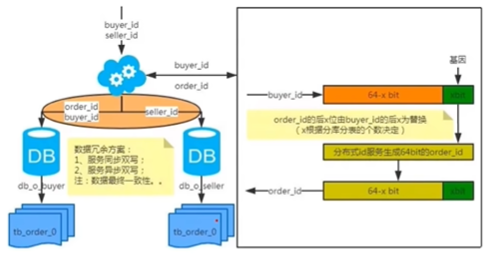

# 分库分表

## 主要内容
+ 数据库瓶颈
+ 水平和垂直拆分库
+ 分库分表工具
+ 分库分表步骤
+ 分库分表问题

## 一、数据库瓶颈
通常数据库系统会遇到IO和CPU瓶颈，最终都会导致数据库的活跃连接数增加，进而接近甚至达到数据库可承载活跃连接数的阀值，可用数据库连接少甚至无连接可用，进而造成数据库系统无法处理新请求。

### 1.1 IO瓶颈
这里的IO可分为磁盘IO和网络IO。

#### 磁盘IO
> 热点数据太多，数据库缓存放不下，每次查询时都会产生大量的IO，从而减低查询速度

##### 解决方案：
+ 分库
+ 垂直分表

#### 网络IO
> 请求的数据太多，网络带宽不足

##### 解决方案
+ 分库

### 1.2 CPU瓶颈
造成CPU瓶颈通常有两种原因：SQL问题和单表数据量太大。

#### SQL问题
如SQL中包含`join`、`group by`、`order by`、非索引字段条件查询等，增加CPU运算操作。

##### 解决方案
+ SQL优化，建立合适的索引，在业务层进行计算

#### 单表数据量太大
单表数据量太大，查询时扫描的行太多，SQL效率低，增加CPU运算的操作

##### 解决方案
+ 水平分表

## 二、分库分表

### 2.1 水平分库

#### 概念
> 以字段为依据，按照一定策略（Hash，取余等），将一个库中的数据拆分到多个库中。

#### 结果
+ 每个库的结构都一样
+ 每个库的数据不一样，没有交集
+ 所有库的并集是全量数据

#### 场景

+ 系统绝对并发量上来了，分表难以根本上解决问题，并且还没有明显的业务归属来垂直分库。

#### 分析
库多了，IO和CPU的压力自然可以成倍缓解。

### 2.2 水平分表

#### 概念
> 以字段为依据，按照一定策略（Hash，取余等），将一个表中的数据拆分到多个表中。

#### 结果
+ 每个表的结构都一样
+ 每个表的数据都不一样，没有交集
+ 所有表的并集是全量数据

#### 场景
系统绝对并发量并没有上来，只是单表的数据量太多了，影响了SQL效率，加重了CPU负担，以致于成为瓶颈。

#### 分析
表的数据量少了，单次SQL执行效率高，自然减轻了CPU的负担。

### 2.3 垂直分库

#### 概念
> 以表为依据，按照业务归属不同，将不同的表拆分到不同的库中。

#### 结果
+ 每个库的结构都不一样
+ 每个库的数据也不一样，没有交集
+ 所有库的并集是全量数据

#### 场景
系统绝对并发量上来了，并且可以抽象出单独的业务模块。

#### 分析
进行到这一步，基本上就可以服务化了。例如，随着业务的发展一些公用的配置表、字典表等越来越多。这时，可以将这些表拆分到单独的库中，甚至可以服务化。再有，随着业务的发展孵化出一套业务模式，这时可以将相关的表拆到单独的库中，甚至可以服务化。

### 2.4 垂直分表

#### 概念
> 以字段为依据，按照字段的活跃性，将表中的字段拆分到不同的表（主表和扩展表）中。

#### 结果
+ 每个表的结构都不一样
+ 每个表的数据也不一样。一般来说，每个表的字段至少有一列交集，一般是主键，用于关联数据
+ 所有表的并集是全量数据

#### 场景
系统绝对并发量并没有上来，表的记录并不多，但是字段多，并且热点数据和非热点数据在一起，单行数据所需的存储空间较大。以致于数据库缓存的数据行减少，查询时会去读取磁盘数据，造成大量的随机读IO，产生IO瓶颈。

## 三、分库分表工具

### Sharding-jdbc

这种Client层方法的优点在于**不用部署**，运维成本低，性能很高。但是各个系统都需要耦合Sharding-jdbc的依赖，升级比较麻烦。

### MyCat

这种代理方案的缺点在于需要部署，自己运维一套中间件，运维成本高，但是好处在于，对各个项目是透明的。如果遇到升级之类的都是自己中间件那里处理即可。

## 四、分库分表步骤

分库分表可以按照以下步骤：
1. 根据容量（当前容量和增长量）评估分库或分表个数
2. 选Key（均匀）
3. 分表规则（Hash、Range等）
4. 执行（一般双写）
5. 扩容问题（尽量减少数据的移动）

假设系统目前有1亿用户：场景10万写并发，100万读并发，60亿数据量。设计时考虑极限情况，32库*32表~64表，一共1000~2000张表：
+ 支持3万的写并发，配合MQ实现每秒10万的写入速度
+ 读写分离6万读并发，配合分布式缓存每秒100读并发
+ 2000张表每张300万，可以最多写入60亿的数据
+ 32张用户表，支撑亿级用户，后续最多也就扩容一次

### 动态扩容的步骤
1. 推荐32库*32表，对于上述量级的公司来说，可能几年都够了
2. 配置路由的规则，`uid%32=库, uid/32%32=表`
3. 扩容的时候，申请增加更多的数据库服务器，呈倍数扩容
4. 由DBA负责将原先数据库服务器的库，迁移到新的数据库服务器上
5. 修改一下配置，重新发布系统，上线，原先的路由规则不用变
6. 直接可以基于N倍的数据库服务器的资源，继续进行线上系统的提供服务

## 五、分库分表问题

### 5.1 非`partition key`的查询问题（水平分库分表，拆分策略为常用的Hash法）

#### 单Key业务

##### 索引表法、缓存映射法

###### 索引表法存在问题
> 如果索引表数据量太大，会导致查询慢，并且会增加IO和CPU的消耗。

###### 缓存映射法
> 缓存映射法，将索引表数据缓存到内存中，查询时直接从内存中读取。

注意事项：要保证高可用，不要被穿透，为了绝对可靠可以表和缓存联用

##### 基因法

通过对`user_name`执行一个随机函数得到一个68bit的code，然后取最后4个bit作为基因。比如4bit基因为`1010`。
写入时，基因法生成`user_id`，如图。关于`xbit基因`，例如要分16张表，2^4=16，所以`x`为4。即4bit基因，这个基因可以是0~15之间的任意值，根据`user_id`查询时可直接取模路由到对应的分库或分表。比如：`user_id=777`,`777`的二进制表示为`0011 0000 1001`，然后拼接4bit基因`1010`,`1010`转换为十进制为`10`。之后，`10%16`,落在表10。
根据`user_id`查询时，先通过`user_name_code`生成函数生成`user_name_code`再对其取模路由到对应的分库或分表。
id生成常用`snowflake`算法。

#### 多Key业务

##### 索引表法、缓存映射法

##### 冗余法

+ 异步双写：包含线上异步（ESB）和线下异步（Log）
+ 按照`order_id`或`buyer_id`查询时路由到`db_o_buyer`库中，按照`seller_id`查询时路由到`db_o_seller`库中。

## 六、分库分表总结
+ 分库分表，首先得知道瓶颈在哪里，然后才能合理地拆分（分库还是分表？水平还是垂直？分几个）。**且不可为了分库分表而拆分**。
+ 选`key`很重要，既要考虑到拆分均匀，也要考虑到非`partition key`的查询
+ 只要能满足需求，拆分规则越简单越好