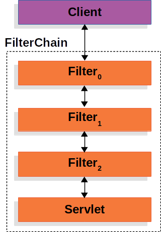

# Spring Security

> 这个模块主要用来学习Spring Security

## 一、Spring Security快速入门

[官方文档|https://docs.spring.io/spring-security/reference/index.html](https://docs.spring.io/spring-security/reference/index.html)

### 1.1 相关概念介绍

#### 1.1.1 功能

+ 身份认证`authentication`
+ 授权`authorization`
+ 防御常见攻击`protection ageinst common attacks`

#### 1.1.2 身份认证

身份认证是验证`谁正在访问系统资源`，判断用户是否有权访问系统资源的过程。
认证用户的常见方式是`要求用户输入用户名和密码`，然后验证用户名和密码是否正确。

#### 1.1.3 授权

授权是身份验证之后，系统会验证`访问某个资源时，用户是否具有访问权限`的过程。
用户无法访问没有权限的资源。

#### 1.1.4 防御常见的攻击
+ CSRF
+ HTTP Headers
+ HTTP Requests

### 1.2 身份认证`authentication`

#### 1.2.1 创建项目
```xml
<!--SpringBoot Version 3.2.5-->
<dependencies>
    <dependency>
        <groupId>org.springframework.boot</groupId>
        <artifactId>spring-boot-starter-thymeleaf</artifactId>
    </dependency>
    
    <dependency>
        <groupId>org.springframework.boot</groupId>
        <artifactId>spring-boot-starter-security</artifactId>
    </dependency>
    
    <dependency>
        <groupId>com.ijunfu</groupId>
        <artifactId>ijunfu-very-threads-common</artifactId>
        <version>${project.version}</version>
    </dependency>
    
    <dependency>
        <groupId>org.springframework.boot</groupId>
        <artifactId>spring-boot-starter-web</artifactId>
        <scope>provided</scope>
        <exclusions>
            <exclusion>
                <groupId>org.springframework.boot</groupId>
                <artifactId>spring-boot-starter-tomcat</artifactId>
            </exclusion>
        </exclusions>
    </dependency>
    
    <dependency>
        <groupId>org.springframework.boot</groupId>
        <artifactId>spring-boot-starter-undertow</artifactId>
    </dependency>
    
    <dependency>
        <groupId>org.projectlombok</groupId>
        <artifactId>lombok</artifactId>
        <optional>true</optional>
    </dependency>
    <dependency>
        <groupId>org.springframework.boot</groupId>
        <artifactId>spring-boot-starter-test</artifactId>
        <scope>test</scope>
    </dependency>
</dependencies>
```

#### 1.2.2 创建`IndexController`

```java
@Controller
public class IndexController {

    @GetMapping("/")
    public String index() {
        return "index";
    }
}

```

#### 1.2.3 创建 `index.html`

```html
<!DOCTYPE html>
<html xmlns:th="https://www.thymeleaf.org">
<head>
    <title>Hello Security | ijunfu</title>
</head>
<body>
<h1>Hello Security</h1>
<a th:href="@{/logout}">退出 2</a>
<a href="/logout">退出 2</a>
</body>
</html>
```

#### 1.2.4 启动项目


#### 1.2.5 注意事项


#### 1.2.6 SpringSecurity默认做了哪些事情
+ 保护应用程序URL，要求对应用程序的任何交互进行身份验证。
+ 程序启动时会生成一个默认用户`user`,密码打印在控制台，例如：`Using generated security password:xxxxxx`
+ 生成默认的登录表单和注销页面
+ 提供基于表单的登录和注销流程
+ 对于Web请求，重定向到登录页面
+ 对于服务器请求，返回`401 未授权`
+ 处理跨站请求伪造（CSRF）攻击
+ 处理会话劫持攻击
+ 写入`Strict-Transport-Security`以确保HTTPS
+ 写入`X-Content-Type-Options`以处理嗅探攻击
+ 写入`Cache-Control`头来保护经过身份验证的资源
+ 写入`X-Frame-Options`以处理点击劫持攻击


### 1.3 Spring Security的底层原理

[官方文档|https://docs.spring.io/spring-security/reference/servlet/architecture.html](https://docs.spring.io/spring-security/reference/servlet/architecture.html)

Spring Security之所以默认帮助我们做了那么多事情，它的底层原理是传统的Servlet过滤器。

#### 1.3.1 Filter
> `Filter`是Servlet规范中的接口，它定义了过滤器必须实现的方法。

Spring Security的Servlet支持是基于Servlet过滤器的，因此首先了解过滤器的作用是很有帮助的。下图显示了单个HTTP请求处理程序的典型分层。


Spring提供了一个名为DelegatingFilterProxy的过滤器实现，它允许在Servlet容器的生命周期和Spring的ApplicationContext之间架桥。Servlet容器允许使用自己的标准注册过滤器实例，但它不知道Spring定义的bean。您可以通过标准Servlet容器机制注册DelegatingFilterProxy，但将所有工作委托给实现过滤器的springbean。
下面是DelegatingFilterProxy如何适应过滤器实例和过滤器链的图片。


Spring Security的Servlet支持包含在FilterChainProxy中。FilterChainProxy是Spring安全性提供的一个特殊过滤器，它允许通过SecurityFilterChain委托给多个过滤器实例。由于FilterChainProxy是一个Bean，它通常被包装在DelegatingFilterProxy中。
下图显示FilterChainProxy的角色。


FilterChainProxy使用SecurityFilterChain来确定应该为当前请求调用哪个Spring安全筛选器实例。
下图显示了SecurityFilterChain的角色。


### 1.4 认证

#### 1.4.1 基于内存的用户认证

##### 1.4.1.1 创建自定义配置

##### 1.4.1.2 基于内存的用户认证流程
+ 程序启动时
  + 创建`InmemoryUserDetailsManager`对象
  + 创建`User`对象，封装用户名和密码
  + 使用`InmemoryUserDetailsManager`将`User`存入`内存`
+ 校验用户时
  + SpringSecurity自动使用`InmemoryUserDetailsManager`的`loadUserByUsername`方法从`内存`中获取User对象
  + 在UsernamePasswordAuthenticationFilter过滤器中的`attemptAuthentication`方法中将用户输入的用户名和密码与从内存中获取到的用户信息进行比较，进行用户认证

#### 1.4.2 基于数据库的用户认证

