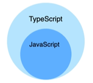
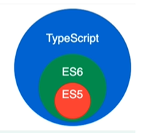
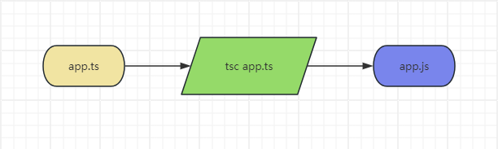

# TypeScript

> `TypeScript`是JavaScript的一个超集，支持ECMAScript 6 标准。

+ **缺点/限制**：无法直接在浏览器中运行，需要编译为JavaScript。

## 一、基础

### 发展史
> + TypeScript是JavaScript的一个超集，支持ECMAScript6标准。
> + TypeScript是由微软研发的开源编程语言
> + TypeScript设计目的是开发大模型应用，它可以编译成纯JavaScript可以运行在任何浏览器上
> 中文官网：[https://ts.nodejs.cn](https://ts.nodejs.cn)

+ 2013年，微软的Visual Studio 2013开始内置支持TypeScript语言
+ 2014年，TypeScript 1.0版本发布。同年，将代码仓库迁移至Github
+ 2016年，TypeScript 2.0版本发布，引入了很多重大的语法功能
+ 2018年，TypeScript 3.0版本发布
+ 2020年，TypeScript 4.0版本发布
+ 2023年，TypeScript 5.0版本发布

### 基本概念

**类型注解**：TypeScript的类型注解是一种轻量级的为函数或变量添加约束的方式。

 

#### JavaScript 是动态类型、弱类型语言
动态类型是指在运行时才会进行类型检查，这种语言的类型错误往往会导致运行时错误。
JavaScript是一门解释型语言，没有编译阶段，所有它是动态类型、

#### TypeScript 是静态类型
静态类型是指编译阶段就能确定每个变量的类型，这种语言的类型错误往往会导致语法错误。
TypeScript在运行前需要先编译为JavaScript，而在编译阶段就会进行类型检查，所以TypeScript是静态类型。

### 安装
```shell
npm install -g typescript
```
JavaScript的运行环境（浏览器和Node.js）无法执行TypeScript代码。所以，TypeScript项目想要运行，必须先转为JavaScript代码，这个代码转换的过程被称之为“编译”。TypeScript官方提供的编译器叫做`tsc`，可以将TypeScript脚本编译为JavaScript脚本。

待安装完成之后，检查一下是否安装成功：
```
tsc -v
```

### 使用TypeScript
在开发TypeScript时，我们通常以`.ts`作为文件的扩展名。
比如：`app.ts`

然后我们执行以下命令将TypeScript转为JavaScript代码：
```
tsc app.ts
//or
tsc app.ts --target es6 // 以es6语法编译
// or
tsc app.ts -w           // 监听文件，自动编译
```
执行过程如下：


### 类型

> 1. 原始数据类型：boolean number string undefined null symbol
> 2. 对象类型：object Array Typle enum function
> 3. 其它类型：any never unknow void

TypeScript要求在变量声明的时候要声明值的类型。如下：
```typescript
let author:string = 'ijunfu'
```

注意：上面所有类型的名称都是小写字母，首字母大写的Number、String、Boolean等在JavaScript语言中都是内置对象，而不是类型对象。


#### 布尔值
```typescript
let flag: boolean = false
```
编译为：
```javascript
var flag = false;
```

#### 数字
```typescript
let age: number = 18
```
编译为：
```javascript
var age = 18;
```

#### 字符串
```typescript
let author: string = 'ijunfu'
```
编译为：
```javascript
var author = 'ijunfu';
```

#### undefined & null
> undefined 和 null 既是类型，又是值
```typescript
let u:undefined = undefined
let n:null = null
```
编译为：
```javascript
var u = undefined;
var n = null;
```

#### symbole
```typescript
let s:symbol = Symbol()
```
编译为：
```javascript
var s = Symbol();
```

#### 数组
```typescript
let arr: number[] = [1, 2, 3]
```
编译为：
```javascript
var arr = [1, 2, 3];
```

#### any【慎用】
> any表示任意类型，可以任意赋值。可以理解为：若一个变量类型设置为any，相当于该变量关闭了类型检测。

另外，如果一个变量不设置任何类型，则默认为any类型。所以在开发中不建议使用该方法。

```typescript
let a: any = 'ijunfu'
a = 123
```
编译为：
```typescript
let a = 'ijunfu';
a = 123;
```

#### unknown
> unknown相对于any是安全的

要想正常使用unknown，必须保证操作是合法的。
例如：
```typescript
let uage:unknown = 5
if(typeof(uage) == 'number') {
    console.log(uage * 2)
}
```
编译为：
```javascript
let uage = 5;
if (typeof (uage) == 'number') {
    console.log(uage * 2);
}
```

#### never
> never表示永远不会有返回值的类型。

比如: 抛出异常、或者死循环，那么该函数永远执行不完，不可能有返回值
```typescript
function func1():never {
    throw new Error()
    return 1    // 报错：无法访问的代码
}

function func2():never {
    while(true) {
        console.log('...')
    }
    return 1    // 报错：无法访问的代码
}
```

#### 值类型
> TypeScript规定，单个值也是一种类型，被称之为“值类型”

例如：
```typescript
let author:'ijunfu' = 'ijunfu'
let age: 18 = 18
```
编译为：
```javascript
let author = 'ijunfu';
let age = 18;
```

### tsconfig.json
> `tsconfig.json`文件是TypeScript项目的配置文件，我们可以指定编译器的选项以自定义TypeScript编译的行为。
> `tsconfig.json`存放于项目的根目录
> `tsconfig.json`文件主要提供给`tsc`编译器使用

通过运行下面指令生成`tsconfig.json`文件：
```shell
tsc --init
```
以下是常见配置：
+ `compilerOptions`：这是`tsconfig.ts`文件中最常见的选项之一。通过`compilerOptions`，我们可以指定编译器的行为。常见的编译器选项包括：
    + `target`: 指定编译后的JavaScript代码要符合的ECMAScript版本
    + `module`: 指定TypeScript代码使用的模块系统，如：CommonJS、AMD、ES2015等
    + `outdir`: 指定编译后的JavaScript输出目录
    + `sourceMap`: 源码映射文件，以便在调试时能够方便地追踪TypeScript代码
    + `strict`: 指定是否启用TypeScript严格模式，以应用更严格的类型检查规则
    + `include`和`exclude`用于指定要包含和排除的文件，支持使用通配符模式
    + `baseUrl`和`paths`：用于配置TypeScript的模块解析规则，可以指定模块的基础路径和路径别名 
+ `include`和`exclude`：这两个选项用于指定要包含和排除的文件。在include中可以使用通配符模式来匹配文件，而在exclude中可以指定要排除的文件或文件夹
+ `references`：这个选项用于指定要引用的其它TypeScript项目。通过引用其它项目，我们可以在一个项目中使用领一个项目的类型定义文件
+ `files`：这个选项用于手动指定要编译的文件列表。如果指定了files，则只会对这些文件进行编译，而不会考虑include和exclude。

### 数组 & 元组

#### 数组
> TypeScript中规定，数组中所有成员的类型必须相同，数量可以不确定

数组的声明语法：
```
let arr:number[] = []
// or
let arr:Array<number>=[]    // 本质属于泛型
```

例如：
```typescript
let arr:number[] = [1,2,3]

let arr2:Array<number> = [1,2,3]
```

注：后添加的元素也必须符合数组的类型

#### 元组
> 元组可以包含不同类型的元素，每个元素具有预定义的位置

```typescript
let arr:[string, number, boolean] = ['ijunfu', 18, true]
```

注：后添加的元素，是元组所有类型的联合类型

### 对象
对于对象来说，我们应该限定对象中每个属性的类型，而不是限定对象这个整体的类型。

#### 基本语法
```
let user:{name:string, age:number} = { name:'ijunfu', age: 18 }
```

#### 可选属性`?`
> 属性后面添加问号，代表属性可有可无

```typescript
let user:{name:string, age?:number} = { name:'ijunfu' }
```

#### 任意属性`any`
> 特殊的可选属性
```
// propName表示属性名，也可以是其他名称，类型必定是string
// 任意属性只有一个没有多个
// 任意属性的类型一定是其他类型的父类
let videoProps:{title:string, [propName:string]:any} 
videoProps = { title:'视频播放', width: 320, height: 240 }
```

#### 只读属性
在对象属性的前面加上`readonly`，代表该属性只能访问，不能修改。
一个对象可以有任意多个只读属性

```
let usr:{readonly name:string, age?:number}

usr = { name:'ijunfu', age:18 }
usr.age = 16
usr.name=2  // Error:无法为“name”赋值，因为它是只读属性
```

#### 内置对象
```
let b:Boolean = new Boolean(1)
let e:Error = new Error("This is a error")
let d:Date = new Date()
let r:RegExp = /[a-z]/
let body:HTMLElement = document.body
let nl:NodeList = document.querySelectorAll('div')
```

### 函数

#### 基本使用
函数的类型声明，需要在声明函数时，给出参数的类型和返回值的类型。
```typescript
function add(n:number, m:number):number {
    return n + b
}
```
如果没有返回值，就是`void`类型：
```typescript
function log(msg: string):void {
    console.log(msg)
}
```
通过变量赋值的形式声明函数，例如: 
```
const add = (n:number, m:number):number => n+m
```

事实上，上面的代码只对等号右侧的匿名函数进行了定义，而等号左边的`add`，是通过赋值操作进行类型推断出来的。如果需要我们手动给`add`添加类型，则应该是这样：
```typescript
let add:(n:number, m:number)=>number = (n:number, m:number):number => n+m
```

单独定义函数类型类型
```
let add:(n:number, m:number) => number
add = function(n:number, m:number): number {
    return n + m
}
```

工作中声明函数，更推荐通过`function`声明的方式。

#### 可选参数
如果某个参数是可选的，那么要在参数后面加问号。
一个函数可以有多个可选参数

```typescript
function add(a: number, b: number, c?:number): number {
    if(c) {
        return a + b + c
    }

    return a + b
}
```

需要注意的是，可选参数必须接在必须参数后面。
换句话说，可选参数后面不允许再出现必需参数了。
> 这是因为JavaScript函数在声明时往往有多余的参数，实际使用时可以只传入一部分参数
比如，数组的forEach方法的参数是一个函数，该函数默认有三个参数`(item, index,array)=>void`，实际上往往只使用第一个参数`(item) => void`。因此，TypeScript允许函数传入的参数不足。

#### Rest参数
`rest`参数表示函数剩余的所有参数，它可以是数组（剩余参数类型相同），也可能是元组（剩余参数类型不同）。

```typescript
// rest参数为数组
function func(...nums:number[]){
    // ...
}

// rest参数为元组
function func(...args:[boolean, number]){
    // ...
}
```

### 联合类型

> 联合类型（Union Types）表示取值可以为多种类型中的一种。
> 联合类型使用`|`分割每个类型
```typescript
let age: string | number

age = '10'
age = 10
```
我们之前定义存储不同数据数组的时候，也可以使用联合类型。
```typescript
const arr:(string | number)[] = [1, '2', 3]
```

当TypeScript不确定一个联合类型的变量到底是哪个类型的时候，
我们只能访问此联合类型的所有类型里共有的属性或方法：
```typescript
function getLength(data:string|number) {
    return data.length  // Error：类型“number”上不存在属性“length”
}
```
访问`string`和`number`的共有属性是没问题的：
```typescript
function getLength(data:string|number) {
    return data.toString()
}
```

> 联合类型的写法

```typescript
let a:string|number|(()=>string)
a='ijunfu'
a=16
a=function() {
    return "ijunfu"
}
```

### 类型别名
> 在TypeScript中，类型别名是给现有类型取一个新的名字，它可以用于提高代码的可读性和可维护性，以及减少重复的类型定义。

#### 最基本的使用方式

```typescript
type MyString = string

let author:MyString = 'ijunfu'
```

`type`关键字可以为原始值、联合类型、元组以及任何我们定义的类型起一个名字

对象数组使用类型别名：
```typescript
type Person = {name: string, age: number, birthday?: Date}

let person: Person[] = [
    {
        name: "ijunfu",
        age: 16
    }
]
```
结合之前类型的写法：
```typescript
type A = {name: string}
type B = number

type C = A | B

let c: C = 8
c = { name: 'ijunfu' }
```

### 类型推断
> 如果没有明确的指定类型，那么TypeScript会依照类型推论（Type Inference）的规则推出一个类型。

以下代码虽然没有指定类型，但是会在编译的时候报错：

```typescript
let a = 18
a = 'ijunfu'    // Error: 不能将类型“string”分配给类型“number”
```

如果定义的时候没有赋值，不管之后有没有赋值，都会被推断成`any`类型而完全不被类型检查：
```typescript
let a

a='ijunfu'
a=18
```
函数的参数类型推论：
```typescript
function add(x, y) {    // 参数“x”隐式具有“any”类型;参数“y”隐式具有“any”类型
    console.log(x + y)
}
```

### typeof 和 keyof 运算符

#### typeof
在`JavaScript`里，`typeof`运算符只可能返回八种结果，而且都是字符串。如下：
```typescript
typeof undefined    // undefined
typeof true         // boolean
typeof 18           // number
typeof 'ijunfu'     // string
typeof {}           // object
typeof parseInt     // function
typeof Symbol()     // symbol
typeof 127n         // bigint
```
TypeScript将`typeof`运算符移植到了类型运算，它的操作数依然是一个值，但是返回的不是字符串，而是该值的TypeScript类型
```typescript
const a = { x: 0 }

type t0 = typeof a      // { x:number }
type t1 = typeof a.x    // number

let a0:t0 = { x: 1} 
let a1:t1 = 1
```
在TypeScript中，根据已有的值来获取值的类型来简化代码的书写：
```typescript
const person: {name: string, age?:number} = { name: 'ijunfu' }

type Person = typeof person

const user:Person = { name: 'wei', age: 18}
```

#### keyof
> keyof 运算符接受一个对象类型作为参数，返回该对象的所有键名组成的联合类型。
> 写法：
> + keyof 类型
> + keyof {}

```typescript
type Person = {name: string, age?: number}

type MyPerson = keyof Person    // 'name' | 'age'
// type MyPerson = keyof {name: string, age?: number}  // 'name' | 'age'

let user:MyPerson =  'name'
user = 'age'
```

### 映射类型
> 映射类型：基于旧类型创建新类型（对象类型），减少重复，提升开发效率

练习一：基本使用
```typescript
type Keys = 'x' | 'y' | 'z'

// type MyType = { x: number, y: number, z: number }
type MyType = { [key in Keys]: number }

let obj: MyType = { x: 10, y: 10, z: 20 }
```

练习二：keyof
```typescript
type Props = { name:string, age:number, birthday: Date }

type MyProps = { [key in keyof Props]:Props[key] }

let o: MyProps = { name: 'ijunfu', age: 16, birthday: new Date()}
```

练习三：可选属性
```typescript
type Props = { name:string, age:number, birthday: Date }

type MyProps = { [key in keyof Props]?:Props[key] }

let o: MyProps = { name: 'ijunfu', age: 16, birthday: new Date()}
```

练习四：只读属性
```typescript
type Props = { name:string, age:number, birthday: Date }

type MyProps = { readonly [key in keyof Props]:Props[key] }

let o: MyProps = { name: 'ijunfu', age: 16, birthday: new Date()}
```

映射类型只能在类型别名中使用，不能在接口中使用。


### 接口

#### 基本使用
在TypeScript中，我们使用接口`interfaces`来定义对象的类型。

我们之前定义对象类型都是形如`{name:string, age:number}`这种形式。
但是如果我们的别的对象也是这种结构，我们不至于每个对象都重新声明一遍这个类型吧？所以就需要用到接口。
> 接口其实就是相当于定义一个模板，以后声明的对象都得根据这个模板要求来

```typescript
interface Person {
    name: string,
    age: number,
    salary: number
}

let usr:Person = { name: 'ijunfu', age: 18, salary: 40000 }
```

接口中同样支持只读属性、可选属性、任意属性：
```typescript
interface Person {
    name: string,
    age?: number,
    readonly salary: number,
    like: string[],
    run?: () => void,
    [propName:string]:string | number | string[] | (() => void)
}
```

#### 接口的继承
语法：
```typescript
interface <interface name> extends [<interface name>,<interface name>,...] {

}
```
只要存在接口的继承，那么我们实现接口的对象必须同时实现该接口以及他所继承的接口的所有属性。

```typescript
interface Person {
    name: string
}

interface User extends Person {
    age: number
}

let user:User = { name: 'ijunfu', age: 16}
```

一个接口可以被多个接口继承，同样，一个接口也可以继承多个接口，多个接口用逗号隔开。


多层继承：需要实现该接口以及所继承的接口和继承接口的接口。例如：
```typescript
interface Person {
    name: string    /* 姓名 */
}

interface Girl extends Person {
    hairstyle: string   /* 发型 */
}


interface WaveGirl extends Girl {
    type: string        /* 卷发类型 */
}

let blackHotPotGirl:WaveGirl = {
    name: 'Lily',
    hairstyle: '卷发',
    type: "黑人烫"
}
```

#### 接口同名会合并
名字相同的接口不会冲突，而是会合并为一个。例如：
```typescript
interface Person {
    name: string
}

interface Person {
    age: number
}

let user:Person = {
    name: 'ijunfu',
    age: 18
}
```

#### 接口中使用联合类型

```typescript
interface Person {
    age: string | number
}

let usr:Person = { age: '18'}

usr = { age: 18 }
```

#### 接口用于定义数组
> [不推荐] 

```typescript
interface MyArray {
    [index:number]:string
}

let arr:MyArray = [ "a", "b" ]
```

#### 接口用于定于函数

```typescript
interface MyFunc {
    ():void
}

let arr:MyFunc = () => {
    console.log('1')
}
```

#### 接口和类型别名的区别

接口和类型别名有以下几点区别：
1. 类型别名能够表示非对象类型，而接口只能表示对象类型（包括数组、函数等）
2. 接口可以继承其它类型，类型别名不支持继承
3. 同名接口会自动合并，同名类型别名则会报错
4. 接口不能包含属性映射，类型别名可以


### 交叉类型
> 交叉类型用于组合多个类型，生成一个包含所有类型特性的新类型。
> 可以理解为将多个类型合并为一个更大的类型，新类型拥有所有原始类型的成员。
> 使用`&`符号表示交叉类型
> 适用于操作对象

```typescript
type Person = { name:string, age:number }

type Employee = { salary:number, address:string }

type C = Person & Employee

let obj:C = {
    name: 'ijunfu',
    age: 18, 
    salary: 40000,
    address: 'China'
}
```

### 类型断言
> 类型断言就是我明确的知道这个数据是字符串，告诉编译器不用检测它了。

#### 基本用法
```
value as type
// or
<type>value
```

例如：
```typescript
let author = 'ijunfu' as string
let age = <number>18
```
注：在React中，形如`<Foo>`的语法在`tsx`中表示的是一个ReactNode；在TypeScript中除了表示类型断言之外，也可能是表示一个泛型。故建议大家在使用类型断言时，统一使用`value as type`的语法。

#### 将一个联合类型断言为其中一个类型
当TypeScript不确定一个联合类型的变量到底是哪个类型的时候，我们只能访问此联合类型的所有类型中共有的属性或方法。
```typescript
function func(x: string | number) {
    console.log(x.toString())   // 仅能使用公共属性/方法
}

function func2(x: string | number) {
    (x as string).substring(1)  // 将类型断言为string
}


func2(100)  // Error: x.substring is not a function
```
注意：将一个联合类型断言为其中一个类型时，不一定正确，所以要慎用。即类型断言只能欺骗TypeScript编译器，让它不报错，无法避免项目运行时的错误。

#### 将任何一个类型断言为any
```typescript
let age:number = 18

console.log((age as any).length)
```
#### 将any断言为任意类型
```typescript
let age:any = 18

console.log((age as string).length)
```
#### 将父类型断言为子类型
```typescript
class Person {
    make() {
        console.log('Person make...')
    }
}

class Student extends Person {
    run() {
        console.log('student run...')
    }
}

let s = new Person();

// 编译通过，运行报错
(s as Student).run()    // Error: s.run is not a function
```
#### 非空断言
> 标志符`!`， 不建议使用；欺骗编译器不报错，但运行时可能会报错
```
let age: number | null

// let a = age.toFixed(2)  // Error： “age”可能为 “null”

let b = age!.toFixed(2) // Error： Cannot read properties of undefined (reading 'toFixed')
```

#### 双重断言

```typescript
interface Girl {
    name: string,
    cost: () => void
}

interface Boy {
    name: string,
    make: () => void
}

function func(obj: Girl) {
    obj as any as Boy
}
```

### 枚举
> 枚举类型拥有定义一些有名字的数字常量。
> 当一个元素有固定的几个值可选时，可以使用枚举来改善代码的可读性和可维护性

#### 基本使用

我们常常会遇到这样的场景：如与后端开发约定订单的状态初始为0，为结账为1，运输中为2，运输完成是3，已收货为4。这样的纯数字会使得代码缺乏可读性。枚举就应用于这样的场景。枚举可以让我们定义一些名字有意义的常量。使用枚举可以清晰地表达我们的意图。TypeScript支持基于数字枚举和字符串的枚举。
例如：
```typescript
enum OrderStatus {
    Start = 1,
    Unpaid,
    Shipping,
    Shipped,
    Complete
}

let orderStatus:OrderStatus = OrderStatus.Start
```
当只写`Start = 1`时，后面的枚举变量就是递增的；
如果不写`=1`, 那么默认初始值为0，依次递增。

#### 枚举解决了哪些问题？
1. 如果直接使用数字，降低了代码可读性，无法知道其含义
2. 如果直接使用字符，首先容易拼写错误，其次数据存储起来占用大
3. 使用枚举即提高了代码的可读性，又降低了数据存储

#### 手动赋值

```typescript
enum Week {
    Sunday=7,       /* 周日 */
    Monday=1,       /* 周一 */
    Tuesday,        /* 周二 */
    Wednesday,      /* 周三 */
    Thursday,       /* 周四 */
    Friday,         /* 周五 */
    Saturday        /* 周六 */
}

console.log(Week['Sunday'] === 7)   // true
console.log(Week['Friday'] === 5)   // true
```
上述的示例中，未手动赋值的枚举项会接着上一个枚举项递增。

如果未手动赋值的枚举项与手动赋值的重复了，TypeScript是不会察觉到这一点的：
```typescript
enum Week {
    Sunday=3,       /* 周日 */
    Monday=1,       /* 周一 */
    Tuesday,        /* 周二 */
    Wednesday,      /* 周三 */
    Thursday,       /* 周四 */
    Friday,         /* 周五 */
    Saturday        /* 周六 */
}

console.log(Week['Sunday'] === 3)       // true
console.log(Week['Wednesday'] === 3)    // true
console.log(Week['Friday'] === 5)       // true
```

手动赋值的实际使用场景，适用于一些对于数字有特殊要求的。比如：
```typescript
enum HttpStatus {
    Success = 200,      /* 成功 */
    NotFound = 404,     /* 找不到页面 */
    Error = 500         /* 服务错误 */
}
```

#### 使用计算值
> 数字枚举在定义值的时候，可以使用计算值和常量。

```typescript
const SUCCESS = 200

function calcBad():number {
    return 401
}

enum HttpStatus {
    Success = SUCCESS,      /* 成功 */
    NotFound = 404,         /* 找不到页面 */
    Error = 500,            /* 服务错误 */
    bad = calcBad()
}
```

> 但是要注意，如果某个字段使用了计算值或常量，那么该字段后面紧接着的字段必须设置初始值，这里不能使用默认的递增值了。

### 泛型
> 泛型是指在定义函数、接口或类的时候，不预先指定具体的类型，而是使用的时候再指定类型的一种特性。
> 简而言之，泛型其实就是类型参数
> 在定义时候定义形参（类型变量），使用的时候传入实参（实际的类型）

#### 函数中使用泛型
在TypeScript中，当调用泛型函数时，如果没有显示地指定泛型类型参数，编译器会进行类型推断，根据传入的实际参数类型。编译器可以推断出泛型类型参数的类型，使得函数调用仍然是正确的。
例如:
```typescript
function identity<T>(arg: T) :T {
    return arg
}

identity<Number>(100)

identity<String>('ijunfu')
```

多个泛型参数：
```typescript
function identity<T, U>(arg: T, arg2: U) :T {
    return arg
}

identity<Number, String>(18, 'ijunfu')

identity<String, Boolean>('ijunfu', true)
```

#### 接口中使用泛型

```typescript
interface Person<T> {
    name: string,
    age: T
}

let p1:Person<number> = {
    name: 'ijunfu',
    age: 18
}

let p2:Person<string> = {
    name: 'ijunfu',
    age: '18'
}
```

#### 类中使用泛型
> 泛型除了能使用基本类型string、number、boolean等，同时也可以是接口、函数、数组等

```typescript
class Person<T> {
    name:string
    age:T
    constructor(name:string, age:T) {
        this.name = name
        this.age = age
    }
}

let p1: Person<string> = new Person('ijunfu', '18')
let p2: Person<(()=>void)> = new Person('ijunfu', ()=>{
    console.log(1)
})
```

> 泛型也可以用来定义数组

```typescript
let arr:Array<number> = [2, 3, 4]
```

#### 类型别名中使用泛型
```typescript
type Age<T> = { age: T }

let a1:Age<number> = { age: 18 }
let a2:Age<string> = { age: '18' }
```

#### 多个类型参数

```typescript
function func<T, U>(arr: T[], f:(arg:T)=>U):U[] {
    return arr.map(f)
}

let a:number[] = func<string,number>(['1', '2', '3'], e => parseInt(e))
```

#### 类型参数默认值
```typescript
function func<T=string>(t:T):T {
    return t
}

let a:string = func('1')
let b:number = func(1)
```
参数默认值多用于`class`中。例如：
```typescript
class Person<T=string> {
    list:T[] = []
    
    add(t:T) {
        this.list.push(t)
    }
}

let p1:Person = new Person()
p1.add('4')
p1.add(1)   // Error: 类型“number”的参数不能赋给类型“string”的参数
```

#### 泛型约束
在函数内部使用泛型变量的时候，由于事先不知道它是哪种类型，所以不能随意的操作它的属性或方法。例如：
```typescript
function func<T>(t:T):T {
    console.log(t.length)   // Error: 类型“T”上不存在属性“length”
    return t
}
```
使用泛型约束来改造上述代码：
```typescript
function func<T extends string>(t:T):T {
    console.log(t.length)
    return t
}
```

练习：
```typescript
class Person {
    name: string
    age: number

    constructor(name: string, age: number) {
        this.name = name
        this.age = age
    }

    getName() {
        return this.name
    }

    getAge() {
        return this.age
    }
}

function getPersonName<T extends Person>(p: Person):string {
    return p.getName()
}
```

#### 泛型的嵌套
形如`<A<b>>`的嵌套写法表示在TypeScript中使用泛型进行多层嵌套。
在泛型中，可以使用尖括号`<`和`>`将泛型参数括起来，当出现多层嵌套时，例如`<A<b>>`，它表示泛型类型`A`中的一个参数`b`是另一个泛型类型或带有泛型参数的类型。
这种嵌套写法主要用于更复杂的数据结构和算法设计，它可以在泛型中引用其他泛型类型的参数，以实现更灵活和抽象的泛型约束。
```typescript
interface Box<T> {
    item: T
}

interface Person<T> {
    name: T
}

let p:Box<Person<string>> = {
    item: {
        name: 'ijunfu'
    }
}
```
### Class

#### JavaScript中的class
```javascript
class Person {
    constructor(name) {
        this.name = name
    }
    getName() {
        return this.name
    }
}
```

#### TypeScript中的class
> TypeScript中class类构造函数里用到的所有属性，必须提前定义类型
```javascript
class Person {
    name:string
    constructor(name:string) {
        this.name=name
    }
}
```

#### 静态属性
> 静态属性，又称之为类属性，只能通过类名访问和修改，对象实例无法访问不到
```javascript
class Constant {
    static readonly AUTHOR:string = 'ijunfu'
}

let author:string = Constant.AUTHOR
```


#### 关于继承
> 通过继承可以将多个类中共有的代码写在一个父类中
> 这样就只需要写一次即可让所有的子类都同时拥有父类中的属性和方法
> 如果子类和父类名字相同，则会覆盖父类的方法（相当于方法重写）

```javascript
class Animal {
    name:string
    age:number
    constructor(name:string, age:number) {
        this.name = name
        this.age = age
    }

    eat() {
        console.log('我在吃饭……')
    }

    sleep() {
        console.log('我在睡觉……')
    }
}

class Dog extends Animal {
    gender: string
    constructor(name:string, age:number, gender:string) {
        super(name, age)
        this.gender = gender
    }

    // 方法的重写
    eat() {
        console.log('我在吃骨头……')
    }
}
```

#### 访问修饰符
TypeScript可以使用三种访问修饰符，分别是`public`、`private`和`protected`。
+ `public`：公有的，可以在任何地方被访问到，默认所有的属性和方法都是被`public`修饰
+ `private`：私有的，不能在声明它的类的外部访问
+ `protected`：受保护的，与private类似，区别是它在子类中也是允许被访问的

```typescript
class Animal {
    protected gender: string
    constructor(
        public name:string, 
        public age:number,
        gender: string
    ) {
        this.name = name
        this.age = age
        this.gender = gender
    }

    private eat() {
        console.log('我在吃饭……')
    }

    public sleep() {
        console.log('我在睡觉……')
    }

    protected live() {
        console.log('好生活……')
    }
}

let dog:Animal = new Animal('旺仔', 2, 'male')
dog.sleep()

class Cat extends Animal {
    
    behavior: string[]

    constructor(
        name:string, 
        age:number,
        gender: string,
        behavior: string[]
    ) {
        super(name, age, gender)
        this.behavior = behavior
    }

    sleep() {
        console.log('我在猫窝舒服的睡觉……')
    }
}

let cat: Cat = new Cat('喵喵', 1, 'female', ['爬树', '捉老鼠'])
cat.sleep()
```
#### 抽象类

##### 抽象方法
> 抽象方法只能出现在抽象类中
```typescript
abstract class Animal {
    abstract eat():void

    abstract sleep():void
}
```

##### 抽象类
> 抽象类中不一定包含抽象方法
```typescript
abstract class Animal {
    abstract eat():void

    sleep() {
        console.log('sleep...')
    }
}
```
> 抽象类中的抽象方法必须被子类（可以是间接）实现的
```typescript
abstract class Animal {
    abstract eat():void

    sleep() {
        console.log('sleep...')
    }
}

class Dog extends Animal {

    eat() {
        console.log('吃骨头')
    }

}

abstract class Cat extends Animal {

    abstract behavior():void
}

class DragenLiCat extends Cat {
    behavior(): void {
        console.log('爬树、捉老鼠')
    }
    eat(): void {
        console.log('吃小鱼')
    }
    
}
```

#### `implements`
> 在TypeScript中，`implement`关键字用于检查一个类是否遵循特定的接口。
> 接口在TypeScript中是一个非常强大的工具，它描述了一组方法和属性的形状，但没有实现它们

```typescript
interface Person {
    id:number
    name:string
}

class User implements Person {
    id: number
    name: string
    constructor(id:number, name:string) {
        this.id=id
        this.name=name
    }
}
```

### 模块
TypeScript模块化是建立在ES6模块化的基础上，与JavaScript中的写法有许多的不同之处。
> 任何包含`import`或`export`语句的文件，就是一个模块。相应地，如果文件不包含`export`语句，就是一个全局的脚本文件
> 模块本身就是一个作用域，不属于全局作用域。模块内部的变量、函数、类只在内部可见，对于模块外部是不可见的。暴露给外部的接口，必须用`export`命令声明；如果其他文件要使用模块的接口，必须用`import`命令来输入。
> 如果一个文件不包含`export`语句，但是希望把它当做一个模块（即内部变量对外不可见），可以在脚本头部添加一行语句`export {}`


#### 基础的导入&导出
导出
```typescript
// a.ts
export const author='ijunfu'
export const helper = function() {}

let name = 'ijunfu'
export default name
```

导入
```
import name, {author, helper} from '/a'
```

#### 类型导出
类型导出一般是复杂的类型，不要导出基本简单的类型
> 对于接口来说，普通导出和默认导出语法后面一致

类型的导出：
```typescript
export { 接口名, type名 }
```

例如：
```typescript
interface Person {
    id:number
    name:string
}

type Animal = { name:string }

interface Person {
    id:number
    name:string
}

type Animal = { name:string }

// 方式一
export { Person, Animal }

// 方式二
export type { Person, Animal }

// 方式三
export { type Animal }
```
导出或者引入的时候加入`type`的好处：
1. 减少编译后输出文件的大小
2. 避免不必要的运行开销
3. 明确表达意图

#### 类型引入
```typescript
// 方式一
import { Person } from './a'
// 方式二
import type { Person } from './a'
// 方式三
import { type Person } from './a'
```

#### 关于接口的默认导出

```typescript
// 方式一
export default interface Animal {
    name: string
}

// 方式二
export interface Person {
    name: string
    age: number
}
```

#### 重导出
> 适用于当你的文件中需要用到好多模块定义的类型，那么可以单独定义一个文件，把这些模板进行重导出，那么我们的项目文件只需要引入这个重导出的文件即可。

```typescript
// a.ts
export interface Person {
    name: string
    age: number
}
```

```typescript
// b.ts
export type { Person } from './a'
```

```typescript
// c.ts
import { Person } from './b'

```

### 命名空间`namespace`
在TypeScript中，命名空间是一个早期的概念，用于提供命名空间的功能，帮助组织代码和防止名称冲突。随着ECMAScript 2015(ES6)模块的引入，命名空间的使用减少了。因为ES6模块提供了更好的代码组织机制。不过，命名空间在一些特定场景还是有它的用武之地的。比如：`没有模块系统的全局脚本环境中`

另外，官方也不推荐使用命名空间了。

```
namespace Utils {
    export function func() {
        console.log(1)
    }

    function func2() {      // 无法在命名空间外部使用
        console.log(2)
    }

    export const a=1
}

Utils.func()
Utils.a
```

> 命名空间可以嵌套、定义函数、类型等
```
namespace My {
    export namespace Helper {
        export function func() {
            console.log(1)           
        }
    }

    export interface Person { name: string}

    export type Animal = { name: string }
}

My.Helper.func()

let c:My.Animal = {
    name: '旺仔'
}
```

本质上作用与ES6模块化是一样的。

### declare 关键字
`declare`关键字用来告诉编译器某个类型是存在的，可以在当前文件中使用。

`declare`的主要作用就是让当前文件可以使用其他文件声明的类型。
`declare`关键字的重要特点是：它只是通知编译器某个类型是存在的，不用给出具体实现。
`declare`只能用来描述已经存在的变量和数据结构，不能用来声明新的变量和数据结构。另外，所有`declare`语句都不会出现在编译后的文件里面。

```typescript
// index.d.ts
declare function func(a:number):void

declare interface Animal {
    name: string
}

declare const author: string
```

## 二、关于`.d.ts`文件

TypeScript中的`.d.ts`文件是类声明文件，它们用来为TypeScript提供有关JavaScript代码结构的类型信息
在TypeScript中，`.d.ts`文件的引入机制有以下几种情况：
1. 同名引入
对于自己写的模块，TypeScript会默认引入与该文件同名的类型声明文件。
例如：如果你有一个`index.js`文件和一个同目录下的`index.d.ts`文件。当你在TypeScript中导入该模块时，类型信息将由`index.d.ts`提供
2. 自动引入
+ 对于`npm`安装的第三方库如`lodash`，如果你安装了对应的类型声明（例如通过`npm install @types/loadsh`），TypeScript会自动识别这些`node_modules/@types`的声明文件，无需显示引用它们
+ 可以通过配置修改：
```json
{
    "compilerOptions": {
        "typeRoots": [ "./typings", "./vendor/types" ]
    }
}
```
`typeRoots`设置类型模块所在的目录，默认是`node_modules/@types`，该目录里面的模块会自动加入编译；一旦指定该属性，就不会再用默认值`node_modules/@types`里面的类型模块
3. 通过`tsconfig.json`配置自动加载
`include`属性是用来指明TypeScript编译器应该包含哪些文件的。
例如：
```json
{
    "include": [
        "src/**/*"
    ]
}
```
`src/**/*`表示包含`src`目录下的所有文件和子目录中的所有文件，无论文件的扩展名是什么，都被纳入TypeScript编译的范围。

`src/**/*`这是一个glob模式，其中
+ `src/`表示源代码位于项目根目录下的`src`目录中
+ `**`表示任意数量的子目录（包括零个）,这是一个通配符
+ `*`表示任意数量的字符（不含路径分隔符），也是一个通配符

如果`tsconfig.json`不做任何特殊设置，默认会加载所有的`.d.ts`文件，包括根目录下和任何文件夹内

4. `///`指令
你可以在文件顶部添加如下指令来显示告诉TypeScript引入特定的`.d.ts`文件：
```
/// <reference path="index.d.ts" />
```
这种方式并不推荐用于模块化的代码，适用于全局脚本的场景。


## 三、第三方库
让我们全部自己加上类型，这显然是不现实的。
第一：很多第三方库默认都自带类型声明文件
第二：`TypeScript`社区也提供了一些第三方库的类型文件。TypeScript社区主要使用`DefinitelyTyped仓库`。

比如，`jQuery`的类型声明文件就发布到`@types/jquery`这个库，使用时执行下面这个命令：
```
npm install @types/jquery --save-dev
```
执行上面的命令，`@types/jquery`这个库就安装到项目`node_modules/@types/jquery`目录，里面的`index.d.ts`文件就是jQuery的类型声明文件

## 四、`declare module` & `declare namespace`

### declare module
`declare module`用于声明外部模块的类型。在使用第三方模块（比如某个npm包）时，你可以使用这种方法来定义模块的类型声明。
通常，你会在类型声明文件`.d.ts`中使用`declare module`。
`declare module`是用来定义模块的类型声明，并且这种声明时可以被导入的，这通常适用于文件模块。
在ES6模块系统中，任何包含顶层`import`或`export`的文件都被视为一个模块。

TypeScript中`declare module`这个`module`指的是哪种文件。

在TypeScript中，`declare module`是用来声明外部模块的。这个模块是指通过`import`或者`require`等方式引入的文件或者库。
这可能是一个`npm`库，如`lodash`或`jQuery`，或者是你的项目中的另一个JavaScript/TypeScript文件。


### declare namespace
`declare namespace`用于声明全局代码的命名空间。
比如，你有一些全局表里或全局库，你可以使用命名空间来包围它们的类型声明。
这适用于脚本环境，而不是模块环境。
`declare namespace`是用来定义全局变量的命名空间，而这些变量可能是由外部脚本或全局库引入的。
它的使用场景一般是在没有模块概念的全局代码（在网页中直接通过<script />标签引入的脚本）

### declare 可以为外部模块添加属性和方法时，给出新增部分的类型描述

```
// index.d.ts
declare interface Person { name:string }

let count:number = 0
```

### declare module描述的模块名可以使用通配符
```
declare module 'my-plugin-*' {
    interface Person {
        name: string
    }
}
```
上面示例中，模块名`my-plugin-*`表示适配所有以`my-plugin-`开头的模块名，比如：`my-plugin-logger`


### 三斜杠`///` 命令
三斜杠(///)是一个TypeScript编译命令，用来指定编译器行为，它只能用在文件的头部。如果用在其它地方，会被当做普通的注释。
最常见的三斜杠命令有以下两种：
1. `/// <reference path='' />`：用来指定引用的文件路径，告诉编译器要在编译过程中包含这个文件
2. `/// <reference types='' />`：用来声明对某个包的类型依赖，通常用于从`@types`包中引用声明

示例一、reference path
```typescript
/// <reference path="some-library.d.ts" />
import * as someLibrary from 'some-library'
```
在该示例中，`some-library.d.ts`包含了`some-library`模块的类型声明。
当TypeScript编译器处理该文件时，它将会同时考虑`some-library.d.ts`中的声明。
这种方式最常见于在编写声明文件的时候，以保证在声明文件之间存在引用关系。

示例二：reference types
```typescript
/// <reference types="node" />
import * as fs from 'fs'
``
在该示例中，我们通过声明`node`来让TypeScript知道`fs`这个名字指的是`Node.js`中的文件系统模块。

注意事项：
TypeScript团队鼓励开发者尽量使用ES6风格的import语句来加载模块和类型。因为这是解析模块路径的标准方式。
三斜杠指令应该只是在严格需要的时候使用。比如当使用旧的或非模块化的代码时。
随着TypeScript的演进和模块解析算法的改进，大多数情况下不再需要三斜杠命令。


## `tsconfig.json`详细配置

### include & exclude 两者组合使用
> include属性指定所要编译的文件列表，既支持逐一列出文件，也支持通配符，文件位置相对于当前配置文件而定。
> exclude属性自定不需要编译的文件列表。
```json
{
    "include": [ "**/*" ],
    "exclude": [ "**/*.spec.ts" ]
}
```

通配符：
1. `?`指代单个字符
2. `*`指代任意字符，不含路径分隔符
3. `**`指定任意目录层级
如果不指定文件后缀名，默认包括`.ts`、`.tsx`和`.d.ts`文件。如果打开了`allowjs`，那么还包括`.js`和`.jsx`。

### extends
`tsconfig.json`可以继承另一个`tsconfig.json`文件的配置。
如果一个项目有多个配置，可以把共同的配置写成`tsconfig.base.json`，其它的配置文件继承该文件，这样便于维护和修改。
`extends`属性用来指定所需要继承的配置文件，它可以是本地文件。
```json
{
    "extends": "./tsconfig.base.json"
}
```
如果`extends`属性指定的路径不是以`./`或`../`开头，那么编译器将在`node_modules`目录下查找指定的配置文件。
`extends`属性也可以继承已发布的`npm`模块里面的`tsconfig`文件。
```json
{
    "extends": "@tsconfig/node12/tsconfig.json"
}
```
`extends`指定的`tsconfig.json`会先加载，然后加载当前的`tsconfig.json`。
如果两者有重名的属性，后者会覆盖前者，即以自定义的优先。

### files
`files`属性指定编译的文件列表，如果其中有一个文件不存在，就会报错。
它是一个数组，排在前面的文件先编译。
```json
{
    "files": [ "a.ts", "b.ts" ]
}
```
该属性必须逐一列出文件，不支持文件匹配。如果文件较多，建议使用`include`和`exclude`属性。

### references
`references`属性是一个数组，数组成员为对象，适合一个大项目由许多小项目构成的情况，用来设置需要引用的底层项目。
```json
{
    "references": [
        { "~": "./src" },
        { "@": "./src" }
    ]
}
```
`references`数组成员既可以指定目录，也可以指定文件。
与此同时，引用的底层项目的`tsconfig.json`必须启用`composite`属性。
```json
{
    "compilerOptions": {
        "composite": true
    }
}
```

### compilerOptions
`compilerOptions`属性用来定制编译行为。这个属性可以省略，这时编译器将使用默认设置。

#### allowJs
`allowJs`允许TypeScript项目加载JS脚本。编译时，也会将`JS`文件一起拷贝到输出目录。
```json
{
    "compilerOptions": {
        "allowJs": true
    }
}
```

#### alwaysStrict
`alwaysStrict`确保脚本以`ECMAScript`严格模式进行解析，因此脚本头部不用写`use strict`。它的值是一个布尔值，默认为true

#### allowSyntheticDefaultImports
`allowSyntheticDefaultImports`允许`import`命令默认加载没有`default`输出的模块。
比如：打开这个设置就可以写`import React from 'react'` 而不是`import * as React from 'react'`

#### allowUnreachableCode
`allowUnreachableCode`设置是否允许存在不可能执行到的代码。
它支持三种值：
+ `undefined`：默认值，编译器显示警告
+ `true`：忽略不可能执行到的代码
+ `false`：编译器报错

#### allowUnusedLabels
`allowUnusedLabels`设置是否允许存在没有用到的代码标签(label)。
它支持三种值：
+ `undefined`：默认值，编辑器显示警告
+ `true`：忽略没有用到的代码标签
+ `false`：编辑器报错

#### baseUrl
`baseUrl`的值为字符串，指定TypeScript项目的基准目录。
由于默认是以`tsconfig.json`的位置作为基准目录，所以一般情况下不需要使用该属性。
```json
{
    "compilerOptions": {
        "baseUrl": "./"
    }
}
```

上面示例中，`baseUrl`为当前目录`./`。那么，当遇到下面的语句，TypeScript将以`./`为起点开始查找`home/banner.ts`文件
```typescript
import { HomeBanner} from 'home/banner'
```

#### checkJs
`checkJs`设置对JavaScript文件同样进行类型检查。打开这个属性，会自动打开`allowJs`。它等同于在JavaScript脚本的头部添加`// @ts-check`命令。
```json
{
    "compilerOptions": {
        "checkJs": true
    }
}
```

#### composite
`composite`打开某些设置，使得TypeScript项目可以进行增量构建，往往跟`incremental`属性配合使用

#### declaration
`declaration`设置编译时是否为每个脚本生产类型声明文件`.d.ts`
```json
{
    "compilerOptions": {
        "declaration": true
    }
}
```

#### declarationDir
`declarationDir`设置生成的`.d.ts`文件所在的目录。
```json
{
    "compilerOptions": {
        "declaration": true,
        "declarationDir": "./types"
    }
}
```

#### declarationMap
`declarationMap`设置生成`.d.ts`类型声明文件的同时，还会生成对应的`Source Map`文件。
```json
{
    "compilerOptions": {
        "declaration": true,
        "declarationMap": true
    }
}
```

#### emitBOM
`emitBOM`设置是否编译结果的文件头添加字节顺序标识`BOM`，默认值是`false`

#### emitDeclarationOnly
`emitDeclarationOnly`设置编译后只生成`.d.ts`文件，不生成`.js`文件

#### esModuleInterop
`esModuleInterop`修复了一些
