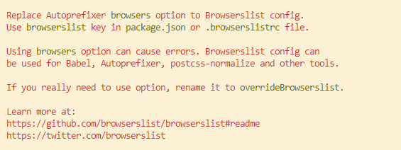

# CSS 预处理： Sass & Less

Sass、Less和stylus都属于CSS预处理器，就是我们常说的CSS框架。

CSS预处理器定义了一种新的语言，其基本思想是`用一种专门的编程语言，为CSS增加了一些编程的特性`。如：变量、语句、函数、继承等概念。将CSS作为目标生成文件，然后开发者就只需要使用这种语言进行CSS的编码工作。

<table>
    <tr>
        <th>序号</th>
        <th>语言</th>
        <th>官网</th>
        <th>VS Code插件</th>
    </tr>
    <tr>
        <td>1</td>
        <td>Less</td>
        <td><a href="https://lesscss.org/">https://lesscss.org/</a></td>
        <td>Easy LESS</td>
    </tr>
    <tr>
        <td>2</td>
        <td>Sass</td>
        <td><a href="https://sass-lang.com">https://sass-lang.com</a></td>
        <td>Easy Sass</td>
    </tr>
    <tr>
        <td>3</td>
        <td>stylus</td>
        <td><a href="https://stylus-lang.com">https://stylus-lang.com</a></td>
        <td></td>
    </tr>
</table>

## 一、语法

### 1.1 注释

#### 单行注释
> 编译时, 会被移除
```less
// 这是单行注释内容
```

#### 多行注释
> 编译时，会被编译
```less
/**
 * 这是多行注释内容 
 */
```

### 1.2 变量、插值、作用域

#### 变量
在Less中，变量以`@`开头，比如：`@color: #333;`
在Sass中，变量以`$`开头，比如：`$color: #333;`

```less
// less
@size: 100px;
@color: #333;

.box {
    width: @size;
    height: @size;
    background-color: @color;
}
```

```sass
// sasss
$size: 100px;
$color: #333;

.box {
    width: $size;
    height: $size;
    background-color: $color;
}

```

#### 插值

```less
//less

@size: 100px;
@color: #333;

@colorKey: color;

@i: 2;

.box@{i} {
    width: @size;
    height: @size;
    @{colorKey}: @color;
}

```

```sass
//sass

$size: 100px;
$color: #333;

$colorKey: color;

$i: 2;

.box#{$i} {
    width: $size;
    height: $size;
    #{$colorKey}: $color;
}

```

#### 作用域

+ `less`: 作用域变量会被提升

```less
@size: 100px;

.box {
    width: @size;   // 获取局部变量值 @size: 200px;
    @size: 200px;
    height: @size;  // 获取局部变量值 @size: 200px;
}
```


+ `scss`：作用域有变量不会提升

```scss
$size: 100px;

.box {
    width: $size;   // 获取全局变量值 $size: 100px;
    $size: 200px;
    height: $size; // 获取局部变量值 $size: 200px;
}
```

### 1.3 选择器嵌套，伪类嵌套
> less和scss写法一致，支持模块化开发
> 建议嵌套层级不超过4层

```
body {

    #app {
        background-color: red;

        &:hover {
            background-color: blue;
        }
    }

}
```

### 1.4 运算、单位、转义、颜色

#### 运算

##### Less

> 当两个单位不同时，会以第一个单位为准；颜色值也可以运算

```less
@size: 100px;

.box {
    width: @size;
    height: @size * 1.5;
    margin: 10em + @size;
    font-size: 20px / 1.5;
    padding: ~"20px / 1.5";
    color: #333 * 2;
}
```

编译后结果：
```css
.box {
  width: 100px;
  height: 150px;
  margin: 110em;
  font-size: 20px / 1.5;
  padding: 20px / 1.5;
  color: #666666;
}
```

##### Sass
> 如果单位不同时不能运算的

```scss
$size: 100px;

.box {
    width: $size;
    height: $size * 1.5;
    font-size: 20px / 1.5;
    // 默认 / 是分割的操作
    padding: (20px / 1.5);
    color: #333333 * 2;
}

```

### 1.5 函数

#### 1.5.1 Less支持的函数
+ round：四舍五入
```
.box {
    width: round(1.6667px);     // 2px
    height: round(1.3333px);    // 1px
}

```
+ percentage：百分比
```
.box {
    width: percentage(0.5);
    height: percentage(0.2);
}
```
+ sqrt
```
.box {
    width: sqrt(25%);
}
```

#### 1.5.2 Sass支持的函数
+ round：四舍五入
```
.box {
    width: round(1.6667px);     // 2px
    height: round(1.3333px);    // 1px
}
```
+ percentage：百分比
```
.box {
    width: percentage(0.5);
    height: percentage(0.2);
}
```
+ random：随机数
```
.box {
    margin: random() * 20;
}
```
+ function：函数
```
@function column-width($col, $total) {
    @return percentage($col/$total);
}

.col-3 {
    width: column-width(3, 24);
}
```

### 1.6 混入、命名空间、继承

#### 1.6.1 Less混入
+ 如果带括号，定义的部分不会被单独解析
+ 如果不带括号，定义的部分也会解析
```
.show {
    display: block;
}

.text-center() {
    text-align: center;
}

.color(@color) {
    color: @color;
    &:hover {
        color: @color * 2;
    }
}

@size: 100px;
.box {
    width: @size;
    height: @size;

    .show;
    
    .text-center;

    .color(#666)
}
```

#### 1.6.2 Scss混入

```
@mixin show() {
    display: block;
}

@mixin color($color) {
    color: $color;

    &:hover {
        color: $color * 2;
    }
}

$size: 100px;
.box {
    width: $size;
    height: $size;
    @include show();
    @include color(#333);
}

```

#### 1.6.3 命名空间（Less）
> 只有Less有命名空间的概念，SCSS没有命名空间的概念

```
#test() {
    .show {
        display: block;
    }
}

.box {
    #test.show;
}
```

#### 1.6.4 Less继承

```
.center {
    text-align: center;
}

.box {
    &:extend(.center);
}

.header {
    &:extend(.center);
}
```

#### 1.6.5 Scss继承

+ `.`：会被单独解析
+ `%`: 不会被单独解析

```
.text-center {
    text-align: center;
}

%text-right {
    text-align: right;
}

.box1 {
    @extend .text-center;
}

.box2 {
    @extend %text-right;
}
```
编译结果：
```
.text-center, .box1 {
  text-align: center;
}
.box2 {
  text-align: right;
}

```

### 1.7 合并

#### 1.7.1 Less合并
```
.box {
    background+: url("a.png");
    background+: url("b.png");
    transform+_: scale(2);
    transform+_: rotate(30deg);
}
```
编译结果：
```
.box {
  background: url("a.png"), url("b.png");
  transform: scale(2) rotate(30deg);
}
```

#### 1.7.2 Scss合并
```
$background: (
    a: url("a.png"),
    b: url("b.png")
);

$transform: (
    a: scale(1.2),
    b: rotate(45deg)
);
.box {
    background: map-values($background);
    transform: zip(map-values($transform)...);
}
```
编译结果：
```
.box {
  background: url("a.png"), url("b.png");
  transform: scale(1.2) rotate(45deg);
}
```

### 1.8 条件判断、循环

#### 1.8.1 Less 条件判断、循环

```
.get(@cn) when (@cn > 4) {
    margin-right: 0;
}

.get(@cn) when (@cn <= 4) {
    margin-right: 1rem;
}

.box1 {
    .get(3);
}

.box2 {
    .get(4);
}

.box3 {
    .get(5);
}

```

#### 1.8.2 Scss 条件判断、循环

```
@mixin marginRight($count) {
    @if($count > 4) {
        margin-right: 0;
    }
    @else{
        margin-right: 1rem;
    }
}

.box1 {
    @include marginRight(3);
}

.box2 {
    @include marginRight(4);
}

.box3 {
    @include marginRight(5);
}
```

### 1.9 导入

> `less` 和 `scss`语法一致

```
//less
@import './reset.less';

//scss
@import './reset.scss';

```

## 二、PostCSS
PostCSS本身使一个功能比较单一的工具。它提供了一种方式用JavaScript代码来处理CSS。利用PostCSS可以实现一些工程化的操作。如：自动添加浏览器前缀，代码合并、代码压缩等。

[官网 | https://postcss.org](https://postcss.org)


### 2.1 安装 & 配置

#### 安装（NodeJS环境）

```
npm i -g postcss-cli
```

#### 配置
```
// postcss.config.js

module.exports = {
  plugins: {
    // postcss-pxtorem 插件的版本需要 >= 5.0.0
    'postcss-pxtorem': {
      rootValue({ file }) { // 
        return file.indexOf('vant') !== -1 ? 37.5 : 75;
      },
      propList: ['*'],  // Css样式转换的属性
    },
  },
};

```

#### 使用
```
// 直接输出css文件
postcss a.css -o a1.css

// 实时监听文件变化
postcss a.css -w a1.css
```


### 2.2 常见插件

#### 搭建环境
```
// 创建项目文件夹
mkdir postcss_demo
cd postcss_demo

// 初始化项目
npm init --y

// 安装PostCSS
yarn add postcss autoprefixer
```

#### 2.2.1 autoprefixer 

##### 安装
```
yarn add autoprefixer
```

##### 配置
> `postcss.config.js`文件必须存放到项目根目录

```
// postcss.config.js
const autoprefixer = require('autoprefixer')
module.exports = {
    plugins: [
      autoprefixer({
        browsers: [ '>0%']
      })
    ]
  }
```

###### 示例代码
```
// src/demo.css
body {
    background-color: red;
}

.box {
    width: 200px;
    height: 200px;
    transform: translate(10px) scale(1.2);
}
```

执行命令：`postcss src/demo.css -o dist/demo.css`

查看`dist/demo.css`，文件内容如下：
```
body {
    background-color: red;
}

.box {
    width: 200px;
    height: 200px;
    -webkit-transform: translate(10px) scale(1.2);
       -moz-transform: translate(10px) scale(1.2);
        -ms-transform: translate(10px) scale(1.2);
            transform: translate(10px) scale(1.2);
}
```

但上述命令运行后，会输出如下警告：

说明我们最好不要把浏览的适配`browsers`写在`postcss.config.js`里，可以选择`package.json`或者`.browserslistrc`文件中进行配置.

###### 在`package.json`中配置
```
// package.json

{
    "browserslist": [
        "last 5 version",
        "> 1%",
        "ie >= 8"
    ]
}
```

###### 在`.browserslistrc`中配置

```
last 5 version
> 1%
ie >= 8
```
以上两种方式任选其一即可。

> 注意：autoprefixer仅处理`.css`文件

#### 2.2.2 postcss-import 合并样式 
> 将通过`@import`导入的CSS样式文件直接合并到当前文件中。

比如在`main.css`中使用`@import reset.css`。使用`postcss-import`之后，就会把`reset.css`中的样式直接合并到`main.css`中。

##### 安装
```
yarn add postcss-import -D
```

##### 配置
```
// postcss.config.js
module.exports = {
  plugins: [
    require('postcss-import'),  // 合并CSS样式
  ]
}
```

#### 2.2.3 cssnano 压缩css代码
> 一个模块化的CSS压缩工具

##### 安装
```
yarn add cssnano -D
```

##### 配置
```
// postcss.config.js
module.exports = {
  plugins: [
    require('cssnano'),       // CSS压缩
  ]
}
```

#### 2.2.4 postcss-cssnext
> 允许你在低版本浏览器使用高级的属性（包括autoprefixer）

为了兼容低版本浏览器，可以使用`postcss-cssnext`进行降级处理。

##### 安装
```
yarn add postcss-cssnext -D
```
##### 配置
```
// postcss.config.js
module.exports = {
  plugins: [
    require('postcss-cssnext'), // 兼容低版本浏览器，降级处理
  ]
}
```

 例如CSS3 变量在低版本浏览器中是不被支持的，使用`postcss-cssnext`降级处理之后，可支持低版本浏览器。

#### 2.2.5 postcss-sprites 精灵图
> 可以把很多小图合并成雪碧图

参考：
+ [https://github.com/2createStudio/postcss-sprites](https://github.com/2createStudio/postcss-sprites)

##### 安装
```
yarn add postcss-sprites -D
```

##### 配置
```
const sprites = require('postcss-sprites')
module.exports = {
  plugins: [
    sprites({
      spritePath: './dist/images',      // 雪碧图生成目录
      stylesheetPath: './src/demo.css'  // 需要进行雪碧图处理的CSS文件
    }), // 小图片合并成雪碧图
  ]
}
```

## 三、Yarn

### 3.1 安装
```
npm i -g yarn
```

### 3.2 卸载
```
npm uninstall -g yarn
```

### 3.3 查看目录

#### 查看全局安装包目录
```
yarn global dir
```

#### 查看yarn的bin目录
```
yarn global bin
```

### 3.4 移除模块

```
yarn global remove <module name>
```

### 3.5 清理缓存

```
yarn cache clean
```

### 3.6 配置源

```
yarn config set disturl https://npm.taobao.org/dist --global

yarn config set registry https://registry.npm.taobao.org --global

yarn config set sass_binary_site http://cdn.npm.taobao.org/dist/node-sass -g

```

## 四、CSS架构

在一个大型项目中，由于页面过多，导致CSS代码难以维护和开发。所以CSS架构可以帮助我们解决文件管理与文件划分等问题。

首先，要对CSS进行模块化处理，一个模块负责一类操作行为。可利用Sass或Less实现。
<table>
    <tr>
        <th>文件夹</th>
        <th>含义</th>
    </tr>
    <tr>
        <td>base</td>
        <td>一些初始化的通用CSS，如重置默认颜色、动画、工具、打印等</td>
    </tr>
    <tr>
        <td>components</td>
        <td>用于构建页面的所有组件，如按钮、表单、表格、弹窗等</td>
    </tr>
    <tr>
        <td>layout</td>
        <td>用于布局页面的不同部分，如页眉、页脚、弹性布局、网格布局等</td>
    </tr>
    <tr>
        <td>pages</td>
        <td>放置页面之间不同的样式，如首页特殊样式，列表页特殊样式等</td>
    </tr>
    <tr>
        <td>themes</td>
        <td>应用不同的主题样式时，如暗黑模式</td>
    </tr>
    <tr>
        <td>abstracts</td>
        <td>放置一些变量、函数、响应式等辅助开发的部分</td>
    </tr>
    <tr>
        <td>vendors</td>
        <td>放置一些第三方独立的CSS文件，如BootStranp、jQuery、Iconfont等</td>
    </tr>
<table>

## 扩展

### 滚动捕捉
> CSS Scroll Snap(CSS滚动捕捉)允许你在用户完成滚动后，锁定特定的元素或位置

示例：
```css
.parent {
    scroll-snap-type: x mandatory;
}

.child {
    scroll-snap-align: start;
}
```

+ `scroll-snap-align: start | center | end`
