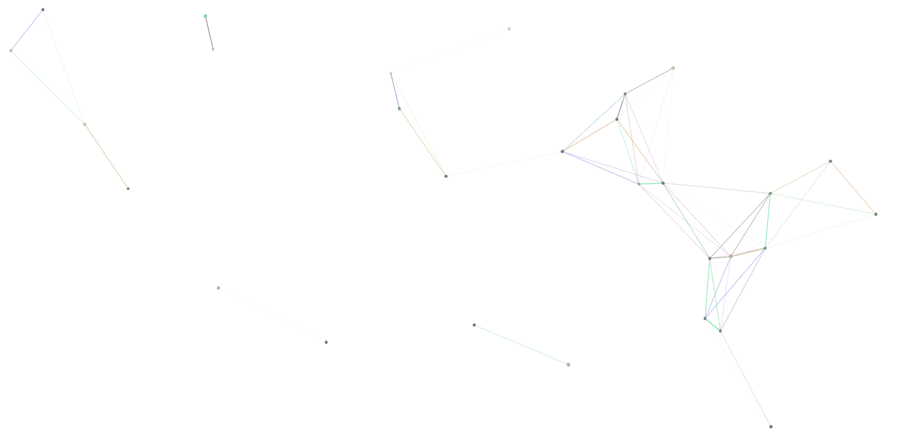

# fu-particle-effects 粒子效果

## Install 安装
```
npm install fu-particle-effects
// or
yarn add fu-particle-effects
// or
pnpm install fu-particle-effects
```

## Use 使用

```
import FuParticleEffects from 'fu-particle-effects'
app.use(FuParticleEffects)
```

## Example 示例

```
<FuParticleEffects />
```

